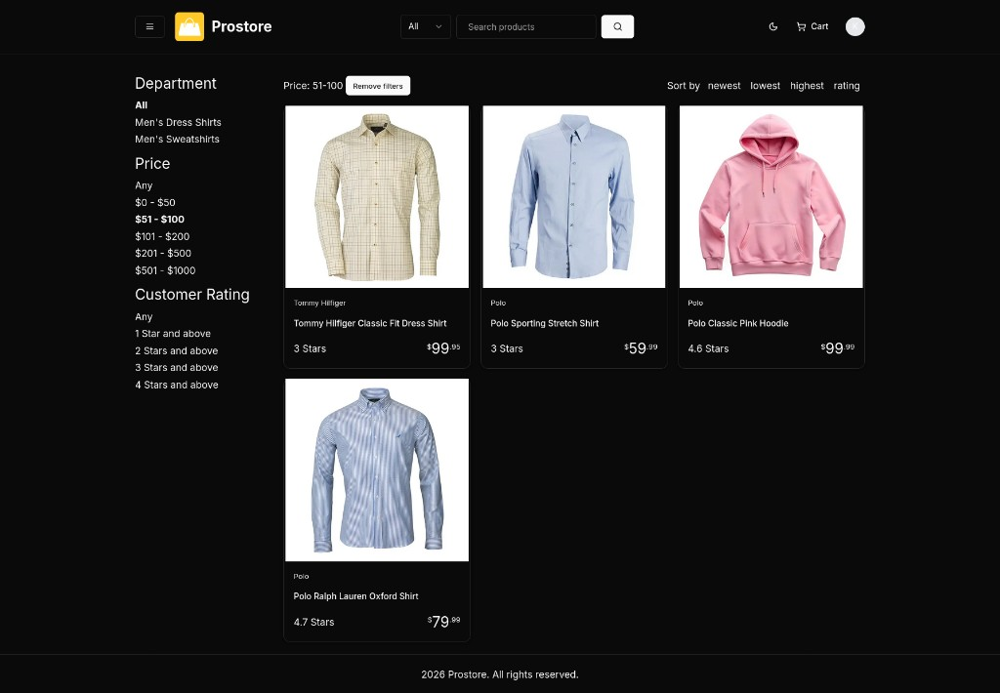
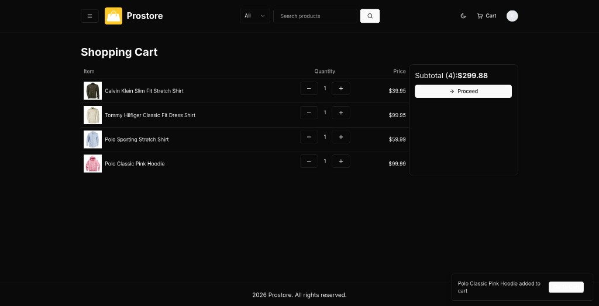
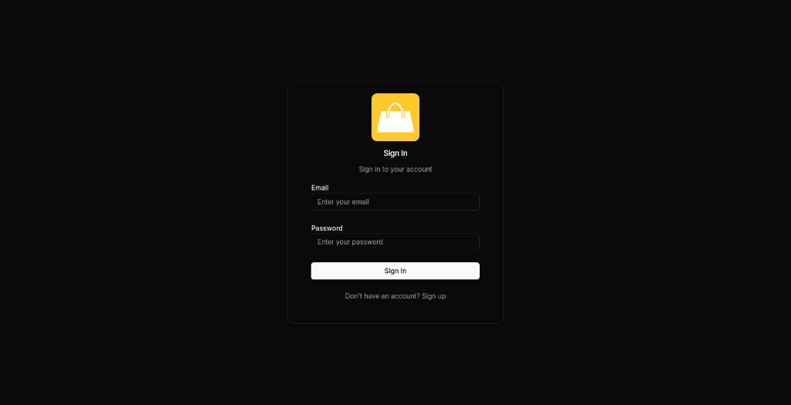

## Prostore


**Live production URL**: [`https://prostore-mu-five.vercel.app`](https://prostore-mu-five.vercel.app)

Prostore is a full‑stack e‑commerce app built with **Next.js App Router**. It includes a storefront (browse/search/filter products, product details, reviews), a full checkout flow (cart → shipping → payment → place order), and an admin dashboard for managing products, orders, and users.

## Features

- **Storefront**: featured products carousel, latest products, product details, ratings & reviews
- **Search & filters**: category, price range, rating, sorting
- **Cart**: session-based cart via cookie, cart merge on sign-in
- **Checkout**: shipping address + payment method + place order
- **Payments**: PayPal checkout and Cash on Delivery (admin can mark paid)
- **Order management**: order details, pay status, delivery status, admin mark delivered
- **Admin dashboard**: overview analytics (sales/users/products), CRUD for products, orders, users
- **Email**: purchase receipt emails via Resend + React Email
- **Uploads**: image upload pipeline via UploadThing
- **UI/UX**: responsive layout, dark mode, Radix/shadcn-style UI components, toasts

## Tech stack

- **Framework**: Next.js 15 (App Router, Server Components), React 19
- **Language**: TypeScript
- **Styling/UI**: Tailwind CSS, shadcn/ui (Radix UI), lucide icons, next-themes (dark mode)
- **Auth**: NextAuth v5 (Credentials) + Prisma Adapter, JWT sessions
- **Database/ORM**: Prisma + Neon (serverless Postgres) via driver adapter
- **Payments**: PayPal Checkout (`@paypal/react-paypal-js`) + Cash on Delivery option
- **Validation & forms**: Zod, React Hook Form
- **Charts**: Recharts (admin overview)
- **Email**: Resend + React Email
- **Uploads**: UploadThing
- **Testing**: Jest (TypeScript via ts-jest)

## Project structure

- `src/app`: routes (storefront, checkout, user, admin) + API handlers
- `src/actions`: server actions for cart/orders/admin/users
- `src/config`: auth + db + env helpers
- `src/lib`: domain helpers (cart totals, paypal client, validation, utils)
- `prisma/schema.prisma`: database schema

## Local development

### Prerequisites

- Node.js (LTS recommended)
- A Postgres database (Neon recommended)

### Install

```bash
npm install
```

### Environment variables

Create a `.env.local` with at least:

- **`DATABASE_URL`**: Postgres connection string
- **`NEXT_PUBLIC_APP_URL`**: app base URL (e.g. `http://localhost:3000`)
- **`PAYPAL_API_URL`**, **`PAYPAL_CLIENT_ID`**, **`PAYPAL_SECRET_ID`**: PayPal API credentials
- **`RESEND_API_KEY`**: for receipt emails
- **`PAYMENT_METHOD`**, **`DEFAULT_PAYMENT_OPTION`**: payment configuration (see `src/constants/payments.ts`)

Note: NextAuth also expects an application secret in production (commonly **`AUTH_SECRET`** / platform-managed secret).

### Database

This repo doesn’t include migrations by default, so you can sync the schema with:

```bash
npx prisma db push
```

Seed sample data:

```bash
npm run seed-db
```

### Run

```bash
npm run dev
```

## Screenshots

### Product listing with filters



### Shopping cart



### Login


